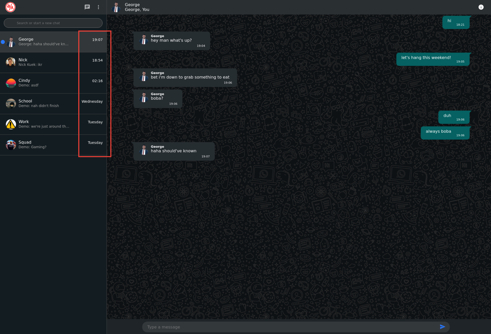
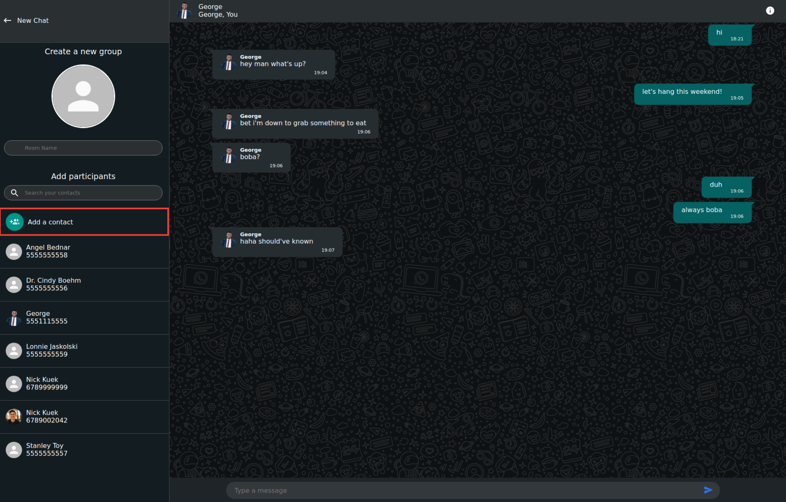

# [WhatsAppening](https://whatsapp-ening.herokuapp.com/)

**WhatsAppening** is a clone of the popular chat app, WhatsApp. Add users to your contacts, create a group with them, and live chat away! WhatsAppening is integrated with AWS so that you can upload your own custom profile and chat room images.

**WhatsAppening** is live on Heroku [here](https://whatsapp-ening.herokuapp.com/)!

Visit the wiki [here](https://github.com/nkuek/WhatsAppening/wiki)!

# About the Project


## Overall Structure
### Built With

* [React](https://reactjs.org/)
* [Redux](https://redux.js.org/)
* [JavaScript](https://www.javascript.com/)
* [Sequelize](https://sequelize.org/)
* [PostgreSQL](https://www.postgresql.org/docs/current/)
* [SocketIO](https://socket.io/docs/v4)
* [CSS](http://www.css3.info/)

### Backend
WhatsAppening's backend was built using a combination of express, sequelize, and Socket.IO.

### Frontend
The frontend was built with React/Redux and Socket.IO-Client. By utilizing React and Redux state, WhatsAppening is a seamless, single-page aplication. All page interactions are controlled by the React/Redux state and web sockets.
## Getting Started

To fork this project simply follow these steps!

### Installing

1. Clone this repository.

    ```
    git clone https://github.com/nkuek/WhatsAppening.git
    ```

2. Install dependencies
    ```
    // backend
    npm install
    ```

3. Create a `.env` file in the backend folder using the provided `.env.example` file.

4. Create a `postgresql` user that matches the information in your `.env` file.
    ```
    // In the psql terminal
    CREATE USER user-from-env-file WITH PASSWORD 'password-from-env-file' CREATEDB
    ```
5. Create a `postgresql` development database
    ```
    // backend
    npx dotenv sequelize db:init
    ```
6. Migrate and seed the database
    ```
    // backend
    npx dotenv sequelize db:migrate
    npx dotenv sequelize db:seed:all
    ```
7. Start the backend
    ```
    npm start
    ```
8. Install dependencies in the frontend
    ```
    // frontend
    npm install
    ```
9. Start the frontend
    ```
    npm start
    ```

# Features


## 1. Convenient, preconfigured Demo User Login


## 2. Chatlist with all your chatrooms sorted by most recent message


## 3. New message indicator when someone else sends you a message


## 4. Search your Chats and Contacts to quickly start a new Chat or find an existing Chat Room


## 5. Convenient dropdown menu for navigation


## 6. Create a new group


## 7. Add contacts


## 8. Search public users by phone number or name


## 9. View and edit your profile name, image, and privacy setting


## 10. View and edit chatroom information


# Obstacles
- State management
    - Because this is a single-page application, managing the React/Redux state was especially important.
    - At times, it would be hard to keep track of the order I needed components to render in.
- Web Sockets
    - I had only ever used web sockets with Flask, so I had to relearn a lot of the syntax to utilize socket.io with express.

# Thoughts
Overall, I am very proud of the progress I've made over the course of creating this project. I think I have a better grasp of web sockets as a whole and I have a lot more experience managing React/Redux state after challening myself to make a single-page application. I learned a lot of cool tricks to control when to render components, such as adding an `isLoaded` key inside each of my reducers. I also got a chance to experiment more with CSS transitions to produce the sliding effects when navigating between menus.
